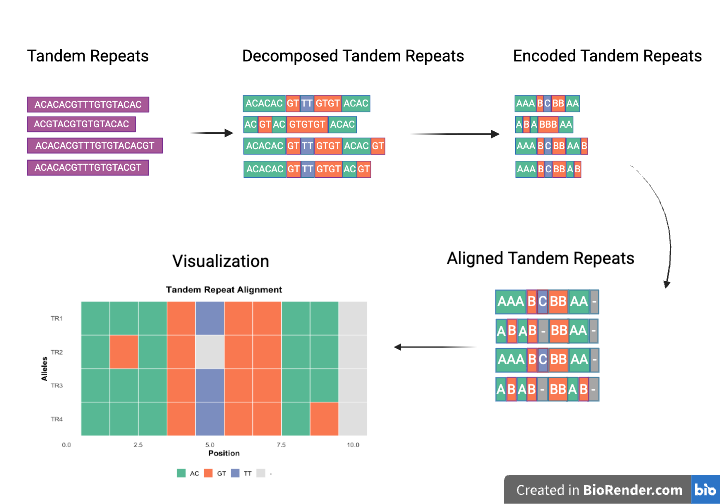

<!-- README.md is generated from README.Rmd. Please edit that file -->

# TRskim

<!-- badges: start -->

<!-- badges: end -->

A tandem repeat visualizer.

## Description

`TRskim` is an R package that visualizes tandem repeat composition by
decomposing sequences into known/novel motifs, encoding then aligning
them, and generates tile plots to compare motif patterns across alleles.
The tool is intended for those researching tandem repeats and would like
to perform a motif composition analysis across alleles.

TRskim was developed in the following environment: R version: 4.5.1
(2025-06-13) - “Great Square Root” Platform: aarch64-apple-darwin20

## Installation

To install the latest version of the package:

``` r
install.packages("devtools")
library("devtools")
devtools::install_github("hassa963/TRskim", build_vignettes = TRUE)
library("TRskim")
```

To run the Shiny app:

``` r
#Under Construction 
```

## Overview

``` r
ls("package:TRskim")
browseVignettes("TRskim")
```

`TRskim` contains 6 functions:

1.  ***decomposeTR*** for decomposing a tandem repeat into their motifs.

2.  ***decomposeTRs*** for decomposing multiple tandem repeats into
    their motifs.

3.  ***encodeTR*** for encoding a decomposed tandem repeat into its
    motifs such that each motif has a one character symbol.

4.  ***encodeTRs*** for encoding decomposed tandem repeats into their
    motifs such that each motif has a one character symbol.

5.  ***alignTRs*** for aligning tandem repeats by their motifs.

6.  ***plotTR*** for visualizing aligned tandem repeats by their motif
    composition.

The package also contains DNAstringSets of tandem repeats and motifs,
called SOL1 and motifs_SOL1. Refer to package vignette for more details.
Overview of the package is shown below.



## Contributions

The author of TRskim is Nour Hassan. TRskim contains 6 functions. All of
which were written by the author and utilizes functions from other
packages. The algorithm for decomposing the tandem repeats in
`decomposeTR` is based on the algorithm from a python library called
TRviz (Park et al., 2023), and ChatGPT was used to dissect said
algorithm and create a skeleton for how to implement something similar
in R. The function also utilizes `Biostrings` by taking in `DNAString`s
and `DNAStringSet`s and the function `matchPattern()` to identify where
the motifs match in the allele. For `alignTRs`, ChatGPT was used to
dissecting logic for aligning tandem repeats by motif. For `plotTR`, the
ggplot function was used to generate a tile plot visualization of the
tandem repeats. ChatGPT was also used to debug code for all the
functions and decipher how to generate visualization for the `plotTR`
function.

## References

- OpenAI. ChatGPT (GPT-5) large language model (2025).
  <https://chat.openai.com/>

- Pagès, H., Aboyoun, P., Gentleman, R. & DebRoy, S. Biostrings:
  Efficient manipulation of biological strings (R package version
  2.77.2, 2025). <https://bioconductor.org/packages/Biostrings>,
  <doi:10.18129/B9.bioc.Biostrings>

- Park, J., Kaufman, E., Valdmanis, P. N. & Bafna, V. TRviz: A Python
  Library for decomposing and Visualizing Tandem Repeat Sequences.
  Bioinformatics Advances 3, (2023).

- Wickham, H. ggplot2: Elegant Graphics for Data Analysis.
  Springer-Verlag, New York, 2016

- Wickham, H. Reshaping data with the reshape package. J. Stat. Softw.
  21, 1–20 (2007).

## Acknowledgements

This package was developed as part of an assessment for 2025 BCB410H:
Applied Bioinformatics course at the University of Toronto, Toronto,
CANADA. `TRskim` welcomes issues, enhancement requests, and other
contributions. To submit an issue, use the GitHub issues.
